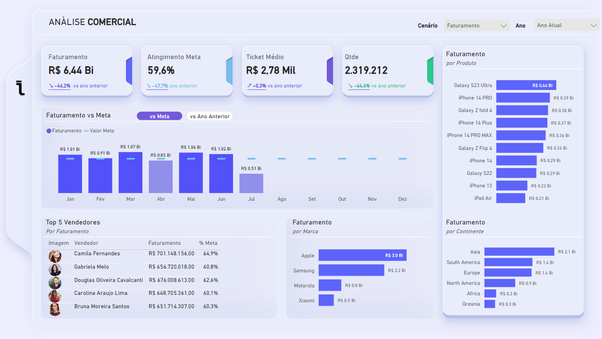

# 📊 Dashboard de Análise Comercial

Este projeto utiliza as ferramentas de visualização e interação do Power BI para criar um dashboard de análise comercial, que visa fornecer uma visão ampla e detalhada sobre o desempenho de vendas da empresa. Abaixo, você encontrará informações sobre o objetivo do projeto, os principais indicadores, e a estrutura do dashboard.

### 🚀 **Acesse o Dashboard**  
[https://example.com/dashboard](https://app.powerbi.com/view?r=eyJrIjoiY2YxOGMwMTEtZjk5OC00M2MyLTgwNDUtNGQ1ZWM0MjA3NGZlIiwidCI6IjExZGJiZmUyLTg5YjgtNDU0OS1iZTEwLWNlYzM2NGU1OTU1MSIsImMiOjR9)

# 🎯 Objetivo
O principal objetivo deste dashboard é facilitar a tomada de decisão estratégica através da visualização clara e interativa de KPIs comerciais. Ele permite que stakeholders e líderes analisem dados importantes relacionados a:

* Faturamento total
* Atingimento de metas
* Desempenho por produto, marca, continente e vendedor
* Comparação com anos anteriores

# 🖥️ Ferramentas Utilizadas
* Power BI: Para criação e publicação do dashboard.
* DAX: Para cálculos e medidas personalizadas.
* Modelagem Dimensional: Organização eficiente dos dados para análise rápida e escalável.

# 📝 Descrição do Dashboard

## 1️⃣ KPIs Principais
* Faturamento Total: Apresentado no topo, com comparações ao ano anterior.
* Atingimento da Meta (%): Percentual de cumprimento das metas definidas.
* Ticket Médio: Valor médio das vendas por transação.
* Quantidade Total de Vendas: Número total de itens vendidos.

## 2️⃣ Faturamento vs Meta
* Gráfico de barras mensais que compara o faturamento atual com os valores de meta.
* Permite identificar os meses com melhores desempenhos e possíveis desvios (exemplo: queda acentuada em julho).

## 3️⃣ Faturamento por Produto
* Lista os produtos de maior faturamento (ex.: Galaxy S23 Ultra, iPhone 14 Pro).
* Visualização em barras horizontais para facilitar a análise dos melhores produtos.

## 4️⃣ Top 5 Vendedores
* Ranking dos vendedores com maior contribuição no faturamento.
* Indicadores incluem: Nome, Faturamento gerado e % de atingimento da meta. Destaque para Camila Fernandes, com um faturamento de R$ 701 Mil (64,9% da meta).

## 5️⃣ Faturamento por Marca
* Apresenta o desempenho de marcas como Apple, Samsung, Motorola e Xiaomi. Apple lidera com R$ 3,0 Bi, seguida por Samsung (R$ 2,2 Bi) e Motorola (R$ 0,8 Bi).
* Visualização simples para identificar quais marcas lideram o mercado.

##6️⃣ Faturamento por Continente
* Distribuição geográfica das vendas.
* Destaques para regiões como Ásia, América do Sul e Europa.

## 💡 Funcionalidades de Interação
O dashboard oferece:

* Filtros Dinâmicos: Por cenário (Faturamento) e ano (Ano Atual).
* Comparação entre contextos: Ex.: "vs Meta" e "vs Ano Anterior".
* Análise Drill-Down: Exploração detalhada por níveis hierárquicos, como meses e produtos.

## 🚀 Benefícios para a Tomada de Decisão
* Clareza Visual: KPIs e gráficos são apresentados de forma limpa e objetiva.
* Insights Rápidos: Identificação de produtos, regiões ou vendedores com melhor ou pior desempenho.
* Planejamento Estratégico: Baseia-se em dados concretos para otimizar as metas futuras.

## 🛠️ Como Executar
* Abra o arquivo .pbix no Power BI Desktop.
* Configure as conexões com a base de dados se necessário.
* Publique no Power BI Service para compartilhamento online.
